# Weather-Monitoring-Platform
Weather Monitor is an application that enables you to monitor air quality and weather data using a distributed network of ESP32-based weather stations. 
These stations communicate with the system via the MQTT protocol, utilizing a Mosquitto broker with a custom mosquitto-go-auth plugin.

# Tech Stack
- Backend:
  - ASP.NET Core 8.0
  - MQTTnet
  - Dapper
  - Microsoft SQL Server
- Frontend:
  - TypeScript
  - Angular 18
  - Angular Material UI
  - Tailwind CSS
- ESP32:
  - Arduino
  - Adafruit_BME280
  - PMserial
  - Arduino MQTT
- Cloud & Infrastructure:
  - Terraform
  - Microsoft Azure:
    - App Service
    - SQL Database
    - Azure Function
    - Container App

# System architecture
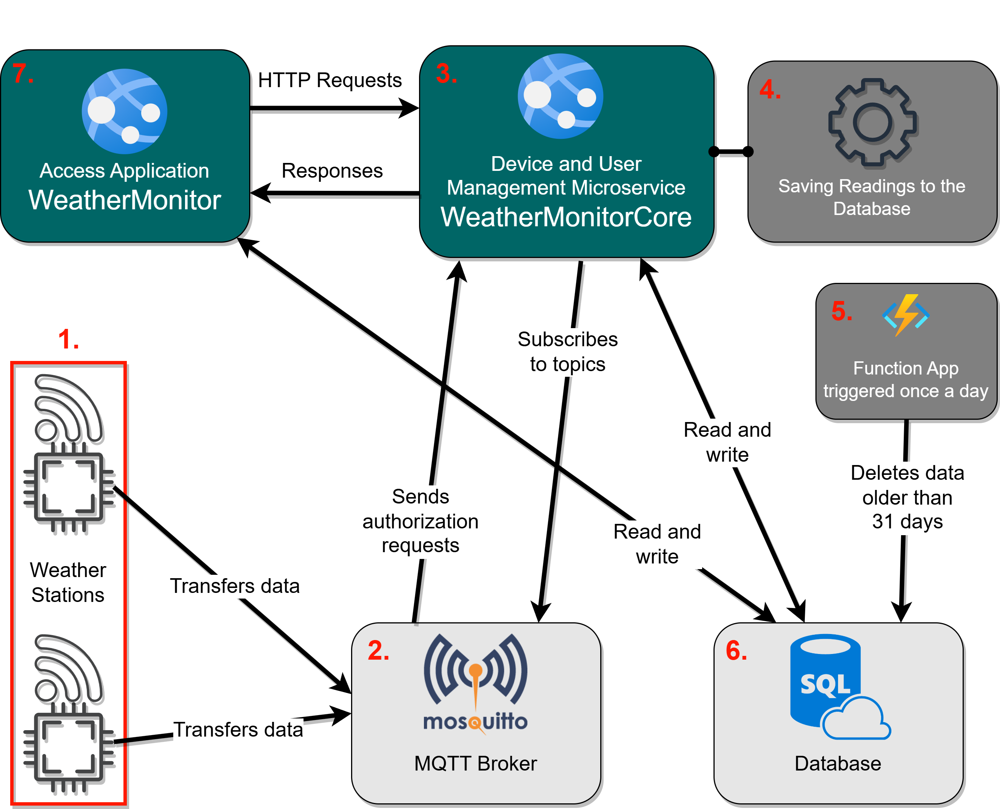
1. Weather stations based on the ESP32 microcontroller measure temperature, humidity, atmospheric pressure, and particulate matter concentrations (PM 1.0, PM 2.5, PM 10). They publish the results in JSON format under specific topics in an MQTT broker.

2. The Eclipse Mosquitto MQTT broker receives messages from the stations and forwards them to subscribers. It uses the `mosquitto-go-auth` plugin, integrated with a microservice, to authenticate clients.

3. The WeatherMonitorCore microservice handles MQTT client authentication and authorization, manages devices, and enables adding new weather stations dynamically—without needing to restart the system.

4. A background process subscribes to station messages, transforms the JSON data into objects, and stores them in an SQL database.

5. A cleanup mechanism based on an Azure Function App removes data older than 31 days, running once per day.

6. The SQL database stores user data, roles, station access information, weather readings, and encrypted MQTT client credentials.

7. The WeatherMonitor application allows users to manage stations, access weather data, and handle authentication. It works in tandem with the WeatherMonitorCore microservice and the database.

# Feature overview
- Landing page.

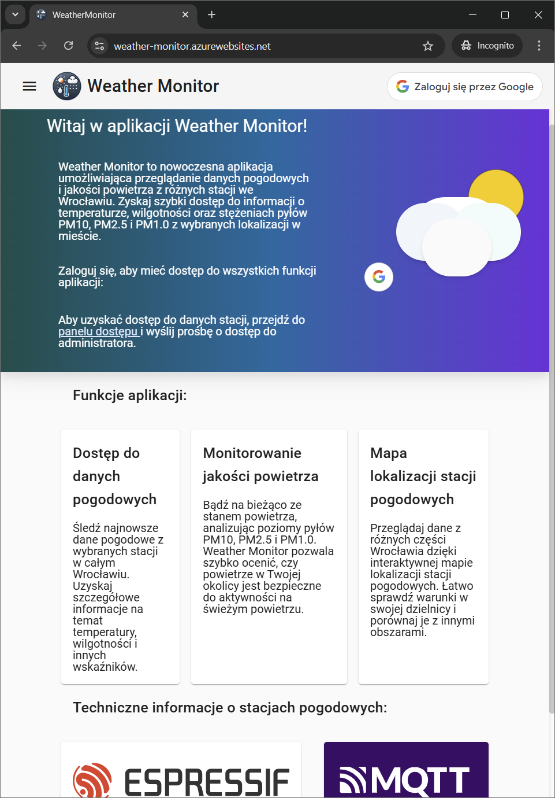

 

- Current weather and air quality data presentation.

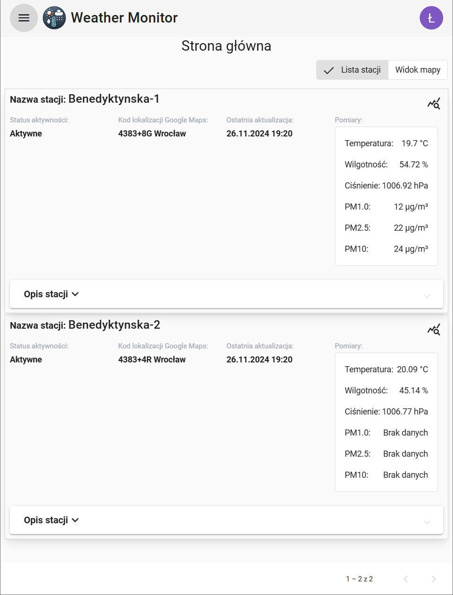

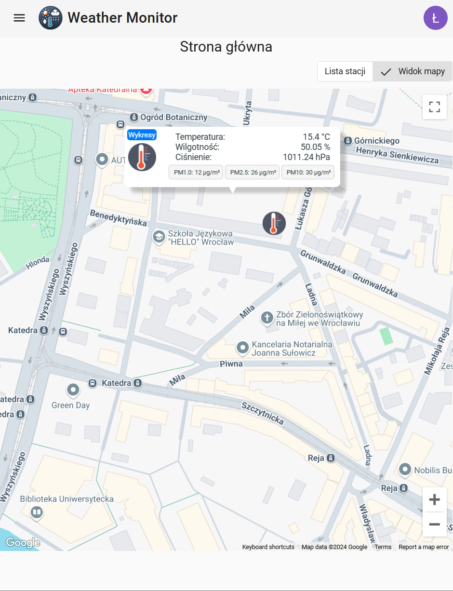

 

- Historical weather and air quality data on charts.

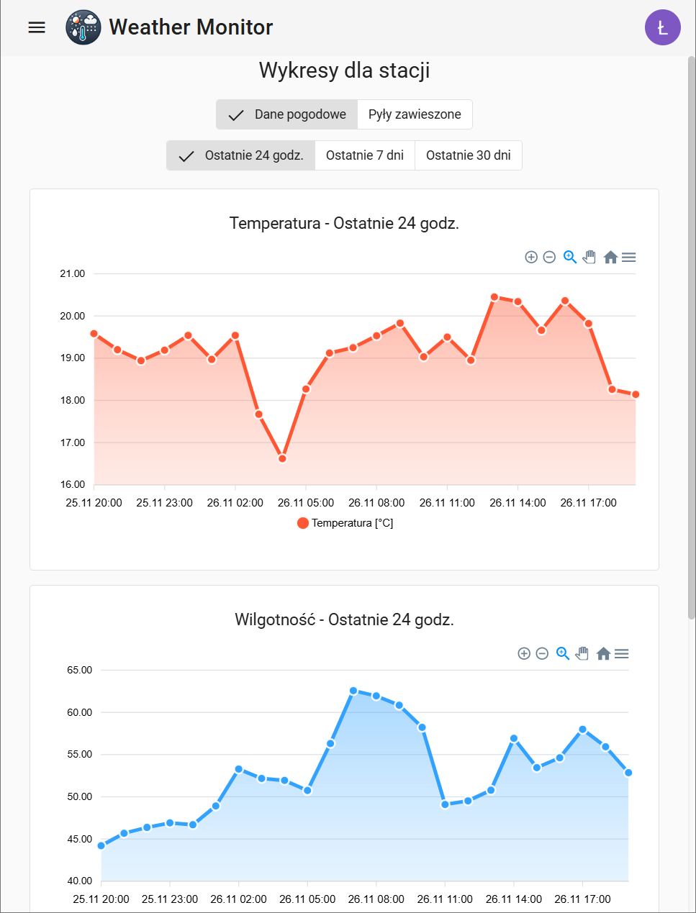

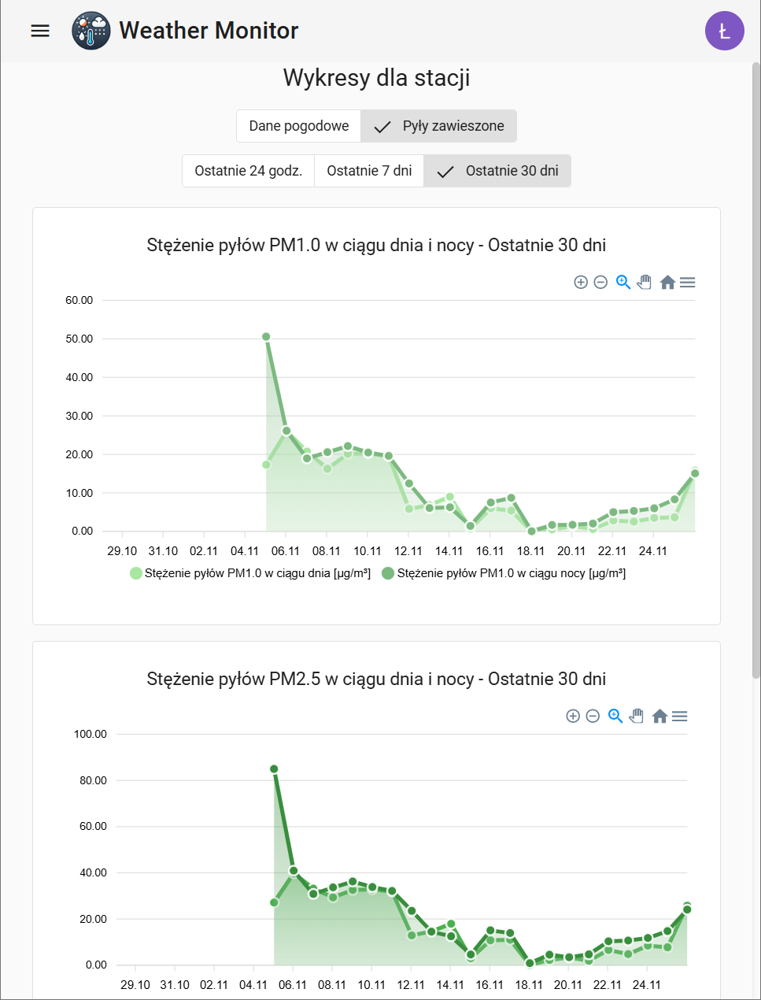

 

- The list of available stations, accessible by selecting an option from the dropdown navigation bar on the left, along with a Google login popup.

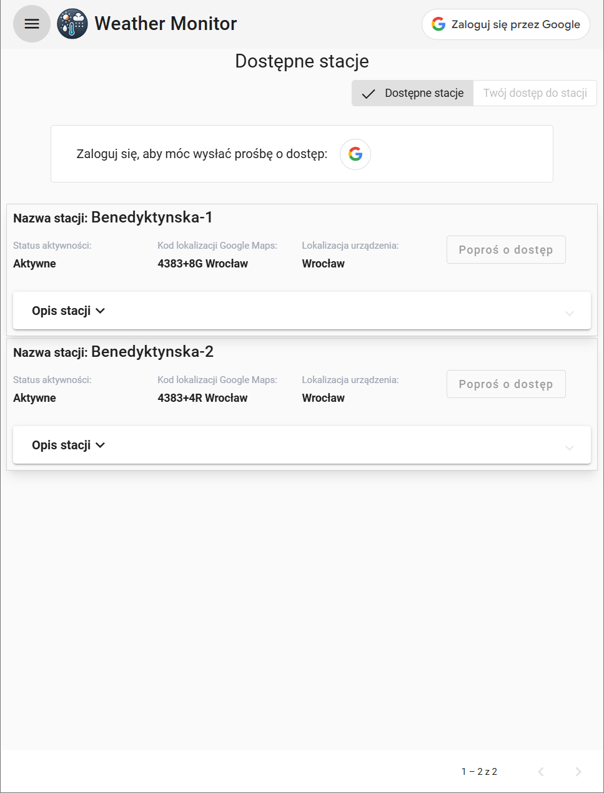

 

- The user can send an access request. If the user already has access or their request was previously denied, they will not be able to confirm sending such a request.

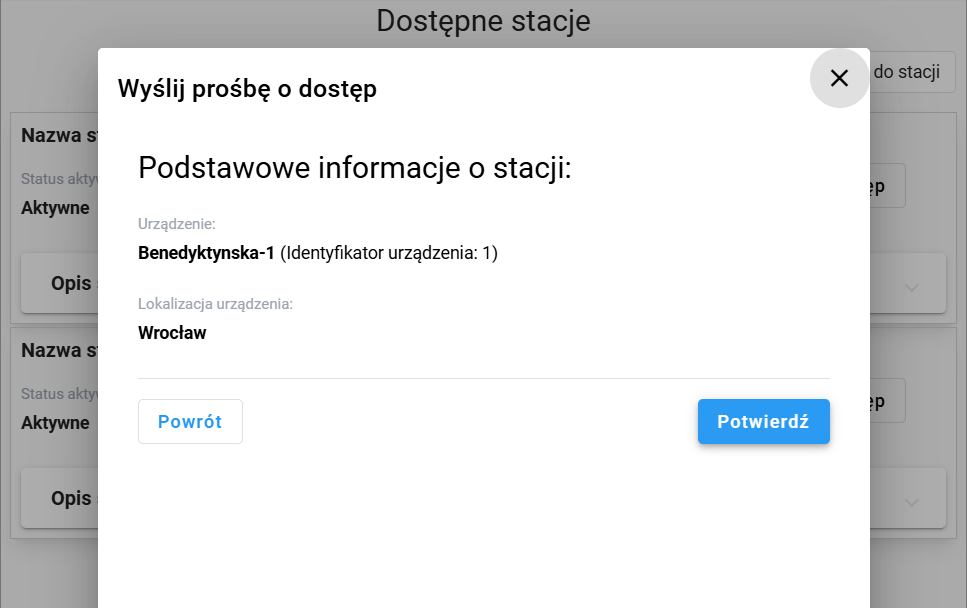

 

- User management view, available exclusively to the administrator, who can review and approve or reject access requests to devices.

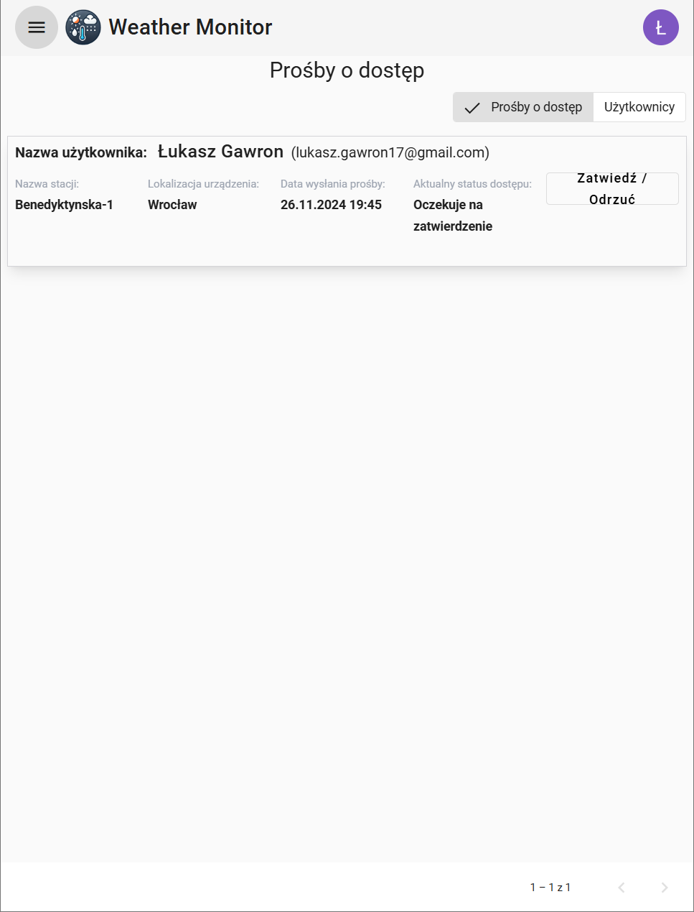

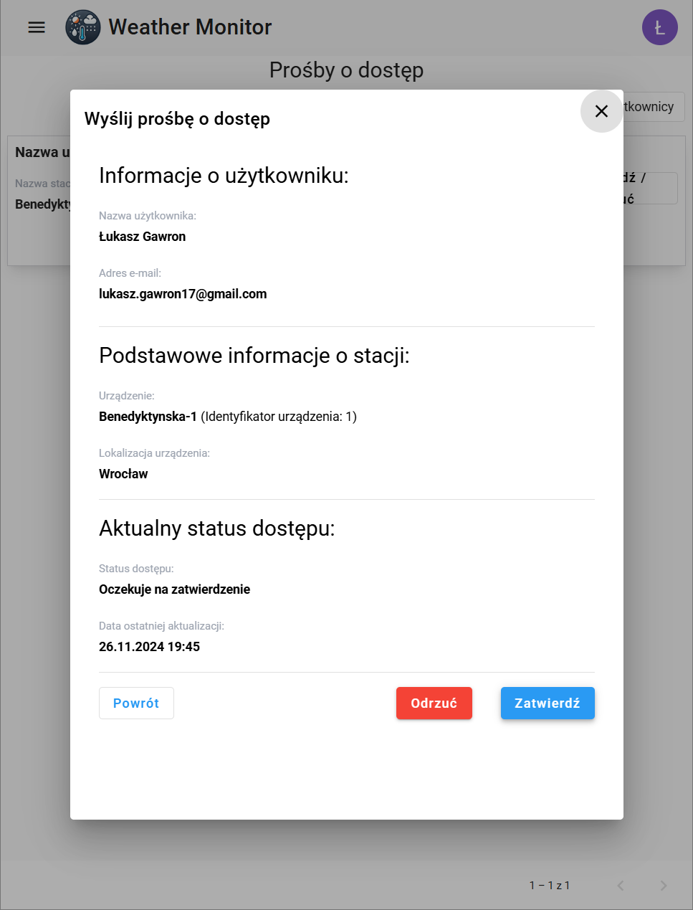

 

- From the user list you can open a dialog with a list of permissions, allowing for permission modification or granting the administrator role.

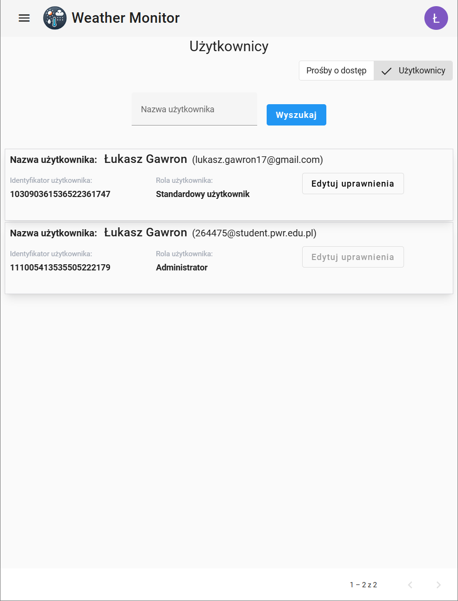

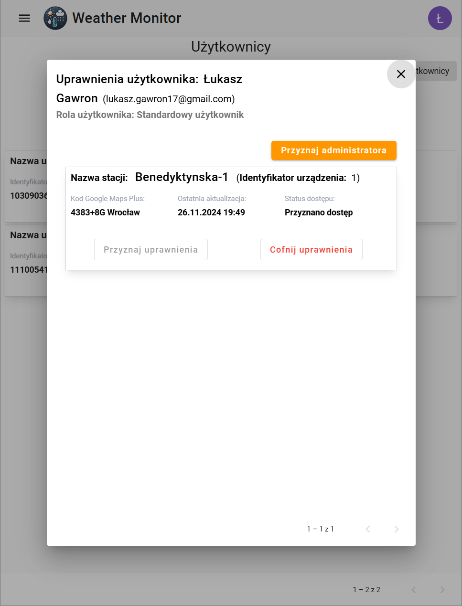

 

- Weather station management view, available exclusively to the administrator.

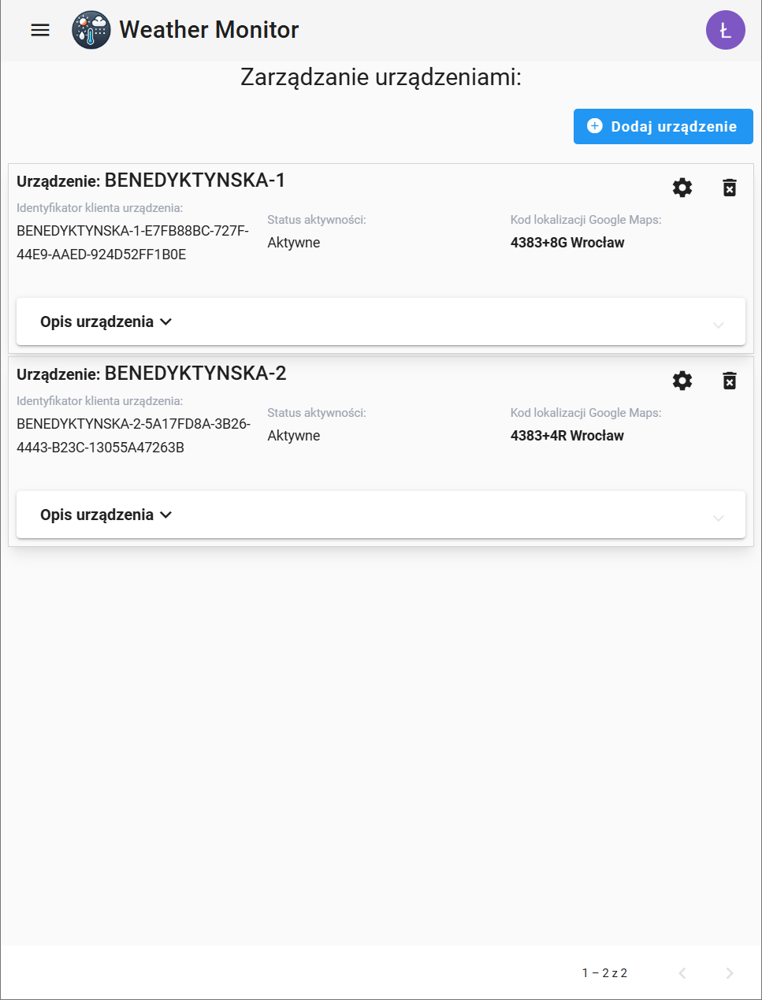

 
